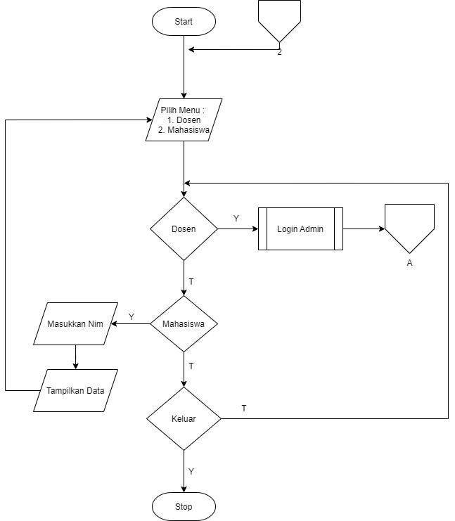

# Praktikum4

- FAQIH IRIANTO (312210021)
- TI.C1.22
- Disini saya menggunakan Aplikasi Code Editor Visual Studio Code

- Flowchart
    
- Coding
    

>>Proses pengerjaan coding ini menggunakan bahasa Python
>>Ruang Lingkup program menggunakan beberapa methode
    - Sintaks Dasar Python
    - Operator Logika
    - Percabangan
    - Perulangan
    - List & Tuple
    - String & Bilangan
    - Fungsi

- Hasil program
    
 
